# 🏢 Campus Stay — Digital Hostel & Residence OS
> **Comprehensive Product Requirements Document (PRD), System Architecture & API Specification**

---

## 1. Executive Summary & Product Vision

**Campus Stay** is a modern, enterprise-grade, multi-tenant SaaS operating system designed for student hostels, university residential campuses, PG networks, and co-living communities.

### Core Value Proposition
- **Multi-Tenant Isolation**: Complete logical and relational isolation across organizations with dedicated vanity slugs (`/organization/:slug`).
- **Tier-Gated Modular SaaS**: Flexible feature toggles and capacity limits tailored to `BASIC`, `PRO`, and `ENTERPRISE` tiers.
- **Granular RBAC**: Dedicated user personas for Super Admins, Hostel Administrators, Staff/Warden moderators, Gate Security Guards, and Residents.
- **Unified Access Resolver**: Combined permission engine checking Role RBAC, Subscription Tier limits, and Organization modular toggles.
- **Consolidated 5-Domain Architecture**: High-cohesion domain boundaries with clean separation of concerns and zero duplicate infrastructure layers.

---

## 2. User Roles & Permission Matrix (RBAC)

| Role Code | User Persona | Accessible Route Scope | Capabilities & Privileges |
| :--- | :--- | :--- | :--- |
| `super_admin` | Platform Owner | `/super-admin/*` | Global tenant lifecycle, workspace provisioning, plan overrides, platform KPI telemetry, audit logs. |
| `admin` | Hostel Administrator | `/organization/:slug/*` | Full workspace authority: tenant identity, branding, staff management, room allocations, student directories, financial publishing, billing, discipline rules. |
| `moderator` | Operational Staff | `/organization/:slug/*` | Scoped via operational domains: **Administration** (students, rooms, lookups), **Attendance Only** (mess meals), **Discipline Warden** (incident flags & resolution), **Full Operational Access**. |
| `security_guard` | Gate Security | `/organization/:slug/scanner`, `/scanner` | Real-time QR camera scanner, manual UID entry, resident pass verification, entry/exit timestamp logging. |
| `student` | Hostel Resident | `/organization/:slug/*` (Resident Portal) | Digital hostel ID badge, live room & bed status, mess due clearance, digital outing request submission, leave tracking, personal incident records. |

---

## 3. SaaS Subscription Tiers & Quota Governance

```mermaid
graph LR
    subgraph BASIC["FREE BASIC TIER"]
        B1["1 Hostel Block"]
        B2["Up to 50 Students"]
        B3["2 Staff Seats"]
        B4["Core Room Management"]
    end

    subgraph PRO["PRO PLAN"]
        P1["Unlimited Blocks"]
        P2["Up to 500 Students"]
        P3["10 Staff Seats"]
        P4["Live QR Scanner"]
        P5["Mess Attendance"]
        P6["Discipline Flags"]
    end

    subgraph ENT["ENTERPRISE PLAN"]
        E1["Unlimited Everything"]
        E2["Custom Domain & White-Label"]
        E3["Bulk CSV Invoicing"]
        E4["Dedicated Support SLA"]
        E5["Automated Escalations"]
    end

    BASIC --> PRO --> ENT
```



---

## 4. Frontend System Architecture (Consolidated 5-Domain Model)

The frontend client is built on **React 19**, **TypeScript 5.8**, **Vite 6**, **Tailwind CSS v4**, **Redux Toolkit**, **React Router v7**, **Radix UI Primitives**, and **Recharts**.

```text
client/src/
├── app/                  # Redux global store, slices, app initialization
├── assets/               # Canonical application assets & branding logos
├── core/                 # Shared core infrastructure, layout shell, auth, API client
│   ├── access/           # Unified Access Layer (canAccess permission resolver)
│   ├── components/       # Canonical UI primitives & application layout shell
│   │   ├── layout/       # OrganizationLayout, Header, Sidebar, RootLayout, ErrorBoundary, Guards
│   │   └── ui/           # Radix primitives (Button, Dialog, Card, Sheet, Table, Tabs, etc.)
│   ├── context/          # auth-context, tenant-context, theme-context
│   ├── hooks/            # use-hostel-lookups, use-media-query, etc.
│   └── lib/              # axios HTTP client wrapper, utils, cn()
│
└── modules/
    ├── super-admin/      # Platform admin tenant management & metrics
    ├── student/          # Resident personal dashboard & pass tracker
    ├── guard/            # Gate QR scanner & pass verification terminal
    │
    └── organization/     # EXACTLY 5 BUSINESS DOMAINS
        │
        ├── overview/             # Domain 1: Dashboard KPIs, charts, attention queue, master lookups summary
        │   ├── components/       # AdminDashboardView, MasterLookupsSummary, StudentProfileCard
        │   ├── context/          # dashboard-context, organization-context
        │   ├── hooks/            # useDashboardStats, useOrganizationData
        │   ├── pages/            # Dashboard.tsx
        │   └── types/            # overview.types.ts, organization.types.ts
        │
        ├── residents/            # Domain 2: Resident lifecycle, student directory, rooms, leaves & housing setup
        │   ├── students/         # Student directory, registration form, CSV bulk import, filters, pagination
        │   ├── rooms/            # Room inventory grid, bed allocations, room transfer dialogs
        │   ├── leaves/           # Long-term leave applications, warden approvals
        │   └── setup/            # HostelSetupPage (Blocks/Wings), AcademicSetupPage (Depts/Batches)
        │
        ├── operations/           # Domain 3: Daily workflows, gate security & discipline
        │   ├── attendance/       # Mess meal verification, live camera scanner, timing banner
        │   ├── outings/          # Gate passes logbook, QR generation, status indicators
        │   └── flags/            # Incident logging, high-risk threshold rules, escalation settings
        │
        ├── finance/              # Domain 4: Billing, payments & invoicing
        │   ├── bills/            # Monthly invoice generator, batch CSV publisher, invoice ledger
        │   └── payments/         # Fee transaction records, offline collection modal, student ledger
        │
        └── organizationSettings/ # Domain 5: Tenant identity, branding, modules & staff administration
            ├── account/          # SaaS subscription tier, active quota gauges, workspace profile
            ├── settings/         # GeneralTab, BrandingTab, NotificationsTab, SecurityTab
            ├── features/         # Modular SaaS tool enable/disable toggles
            └── staff/            # Staff directory, 3-domain privilege forms, account provisioning
```

---

## 5. Page & Route Sitemap Matrix

| URL Route | Page Component | Domain Module | Allowed Roles | Feature Dependency |
| :--- | :--- | :--- | :--- | :--- |
| `/organization/:slug/dashboard` | `Dashboard.tsx` | `overview` | `admin`, `moderator`, `student` | None (Core) |
| `/organization/:slug/students` | `Students.tsx` | `residents/students` | `admin`, `moderator` | `students` |
| `/organization/:slug/students/new` | `NewStudent.tsx` | `residents/students` | `admin`, `moderator` | `students` |
| `/organization/:slug/students/import` | `ImportStudents.tsx` | `residents/students` | `admin`, `moderator` | `bulkImport` |
| `/organization/:slug/rooms` | `Rooms.tsx` | `residents/rooms` | `admin`, `moderator` | `roomManagement` |
| `/organization/:slug/leaves` | `Leaves.tsx` | `residents/leaves` | `admin`, `moderator`, `student` | `leaves` |
| `/organization/:slug/hostel-setup` | `HostelSetupPage.tsx` | `residents/setup` | `admin`, `moderator` | None (Core) |
| `/organization/:slug/academic-setup` | `AcademicSetupPage.tsx` | `residents/setup` | `admin`, `moderator` | None (Core) |
| `/organization/:slug/attendance` | `Attendance.tsx` | `operations/attendance` | `admin`, `moderator` | `messAttendance` |
| `/organization/:slug/outings` | `OutingsLog.tsx` | `operations/outings` | `admin`, `moderator`, `student` | `outings` |
| `/organization/:slug/flags` | `Flags.tsx` | `operations/flags` | `admin`, `moderator`, `student` | `incidentReporting` |
| `/organization/:slug/bills` | `Bills.tsx` | `finance/bills` | `admin`, `student` | `billing` |
| `/organization/:slug/payments` | `Payments.tsx` | `finance/payments` | `admin`, `student` | `feePayments` |
| `/organization/:slug/account` | `AccountPage.tsx` | `organizationSettings/account`| `admin` | None (Core) |
| `/organization/:slug/settings/general` | `GeneralSettingsPage.tsx`| `organizationSettings/settings`| `admin` | None (Core) |
| `/organization/:slug/settings/branding`| `BrandingSettingsPage.tsx`| `organizationSettings/settings`| `admin` | None (Core) |
| `/organization/:slug/settings/features`| `FeaturesSettingsPage.tsx`| `organizationSettings/settings`| `admin` | None (Core) |
| `/organization/:slug/settings/staff` | `StaffSettingsPage.tsx` | `organizationSettings/staff` | `admin` | None (Core) |
| `/organization/:slug/settings/staff/new` | `CreateModeratorPage.tsx`| `organizationSettings/staff` | `admin` | None (Core) |
| `/organization/:slug/settings/staff/:id/edit`| `EditModeratorPage.tsx`| `organizationSettings/staff` | `admin` | None (Core) |
| `/organization/:slug/settings/notifications`| `NotificationsSettingsPage.tsx`| `organizationSettings/settings`| `admin`| None (Core) |
| `/organization/:slug/settings/security`| `SecuritySettingsPage.tsx`| `organizationSettings/settings`| `admin` | None (Core) |
| `/organization/:slug/scanner` | `GuardScanner.tsx` | `guard` | `security_guard`, `admin` | `gateSecurity` |

---

## 6. Complete REST API Design & Contracts

All backend endpoints are mounted under `/api/v1` and protected with JWT Bearer Authentication, Tenant Scoping (`x-tenant-slug` or JWT `organizationId`), and Schema Validation.

### 6.1 Authentication & Profile (`/api/v1/auth`)
- `POST /auth/login` — Authenticate user and issue scoped JWT token.
- `POST /auth/register` — Initial workspace signup (provisions new tenant organization + root admin).
- `GET /auth/me` — Retrieve active session user profile, tenant organization context, and role capabilities.
- `POST /auth/change-password` — Update user credential hash.

### 6.2 Organization & Workspace Settings (`/api/v1/organizations`)
- `GET /organizations` — Super admin list of all tenant workspaces.
- `GET /organizations/:id` — Retrieve organization details by ID or Slug.
- `PATCH /organizations/:id` — Update tenant profile (Name, Type, Location, Contact Phone, Timezone, Academic Year).
- `PATCH /organizations/:id/branding` — Update theme tokens (`primaryColor`, `secondaryColor`, `logoUrl`).
- `PATCH /organizations/:id/features` — Enable or disable modular feature flags.
- `PATCH /organizations/:id/plan` — Update subscription tier (`BASIC`, `PRO`, `ENTERPRISE`).

### 6.3 Master Lookups & Structure (`/api/v1/lookups`)
- `GET /lookups` — Aggregated lookups (blocks, departments, academic years, rooms).
- `GET /lookups/blocks` — List all active hostel blocks with gender wings.
- `POST /lookups/blocks` — Create new hostel block (validates `maxBlocks` plan quota).
- `PUT /lookups/blocks/:id` — Update block name, code, gender allocation.
- `DELETE /lookups/blocks/:id` — Remove block (blocks if rooms are assigned).
- `GET /lookups/departments` — List academic departments.
- `POST /lookups/departments` — Create department.
- `DELETE /lookups/departments/:id` — Remove department.
- `GET /lookups/academic-years` — List academic admission batches.
- `POST /lookups/academic-years` — Create academic year.
- `PATCH /lookups/academic-years/:id/toggle-completed` — Mark batch graduated & auto-release occupied beds.

### 6.4 Residents & Directory (`/api/v1/students`)
- `GET /students` — Filtered student directory (supports pagination, search, department, batch, status, room filter).
- `POST /students` — Register individual student with biometric/hostel UID (validates `maxStudents` quota).
- `POST /students/bulk-import` — Parse & import student records from CSV.
- `GET /students/:id` — Retrieve full student dossier (assigned bed, outing passes, dues, discipline incidents).
- `PATCH /students/:id` — Update student profile, room transfer, or status (`active`, `suspended`, `graduated`).
- `DELETE /students/:id` — Delete student record and release assigned bed.

### 6.5 Rooms & Beds (`/api/v1/rooms`)
- `GET /rooms` — List rooms by block and floor with real-time bed capacity.
- `POST /rooms` — Create room with specific bed count (validates `maxRooms` quota).
- `POST /rooms/:id/allocate` — Atomically assign student to a vacant bed.
- `POST /rooms/:id/deallocate` — Release occupied bed.

### 6.6 Operations: Daily Gate Outing Passes (`/api/v1/outings`)
- `GET /outings` — Outing logbook (active, overdue, approved, rejected, completed).
- `POST /outings` — Submit digital outing pass request (student or warden).
- `PATCH /outings/:id/approve` — Approve pending outing request.
- `PATCH /outings/:id/exit` — Security scan / log resident gate exit timestamp.
- `PATCH /outings/:id/entry` — Security scan / log resident return entry timestamp.

### 6.7 Operations: Mess Attendance (`/api/v1/attendance`)
- `GET /attendance` — Today's meal logs by session (`breakfast`, `lunch`, `dinner`).
- `POST /attendance/scan` — Verify QR or Hostel UID and log single meal attendance scan.
- `POST /attendance/bulk` — Batch meal attendance logging.

### 6.8 Residents: Leaves (`/api/v1/leaves`)
- `GET /leaves` — List submitted leave applications with date range and destination.
- `POST /leaves` — Apply for multi-day resident leave.
- `PATCH /leaves/:id/status` — Approve or reject leave request.

### 6.9 Operations: Discipline Flags & Risk Rules (`/api/v1/flags`)
- `GET /flags` — List all active and resolved student disciplinary incidents.
- `POST /flags` — Raise disciplinary incident report with categorization (`discipline`, `billing`, `attendance`).
- `PUT /flags/:id/resolve` — Warden signoff marking flag resolved.

### 6.10 Finance: Billing & Invoicing (`/api/v1/bills`)
- `GET /bills` — List generated monthly bills, payment statuses, and overdue balances.
- `POST /bills/generate` — Generate monthly recurring mess and room rent invoices for all active residents.
- `POST /bills/bulk-csv` — Bulk publish custom student fee ledger from CSV.
- `GET /bills/my-bills` — Resident authenticated personal invoice history.

### 6.11 Finance: Fee Payments (`/api/v1/payments`)
- `GET /payments` — Organization financial transaction ledger.
- `POST /payments/record` — Record offline payment (Cash, UPI, Bank Transfer) with receipt number.
- `GET /payments/my-payments` — Resident fee payment receipts.

### 6.12 Staff Administration Directory (`/api/v1/moderators`)
- `GET /moderators` — List all staff accounts and assigned operational domains.
- `POST /moderators` — Provision staff member with 3-domain responsibility matrix (`Residents`, `Operations`, `Finance`).
- `PATCH /moderators/:id` — Update staff permissions or deactivate login.
- `DELETE /moderators/:id` — Revoke staff account.

---

## 7. Security, Tenancy & Compliance Standards

1. **Strict Multi-Tenancy**:
   - Every database collection includes an indexed `organizationId` foreign key.
   - Cross-tenant queries are structurally prevented by backend schema hooks and tenant resolution middleware.
2. **Unified Authorization (canAccess)**:
   - Evaluates RBAC role permissions, subscription tier feature gating (`BASIC`, `PRO`, `ENTERPRISE`), and workspace feature switches before rendering pages or performing operations.
3. **Audit Persistence Resilience**:
   - Critical domain operations (Staff Creation, Student Graduation, Bed Reallocation, Payment Settlement) log immutable audit records.
4. **Optimistic Locking on Bed Allocations**:
   - Bed allocations use atomic database queries to prevent double-booking race conditions during student intake drives.
5. **Input Sanitization & Injection Prevention**:
   - All input parameters are sanitized against NoSQL selector injection, prototype pollution, and HTML injection.

---

## 8. Development & Build Scripts

```bash
# Frontend Development Server (Vite)
cd client
npm run dev

# Frontend Production Build & Bundle Inspection
npm run build

# Frontend TypeScript Typechecking
npx tsc --noEmit

# Backend Server (Node/Express API)
cd ../server
npm run dev

# Backend Automated Integration Test Suite (Jest)
npm run test
```

---
*Maintained by the Campus Stay Core Engineering Team.*
